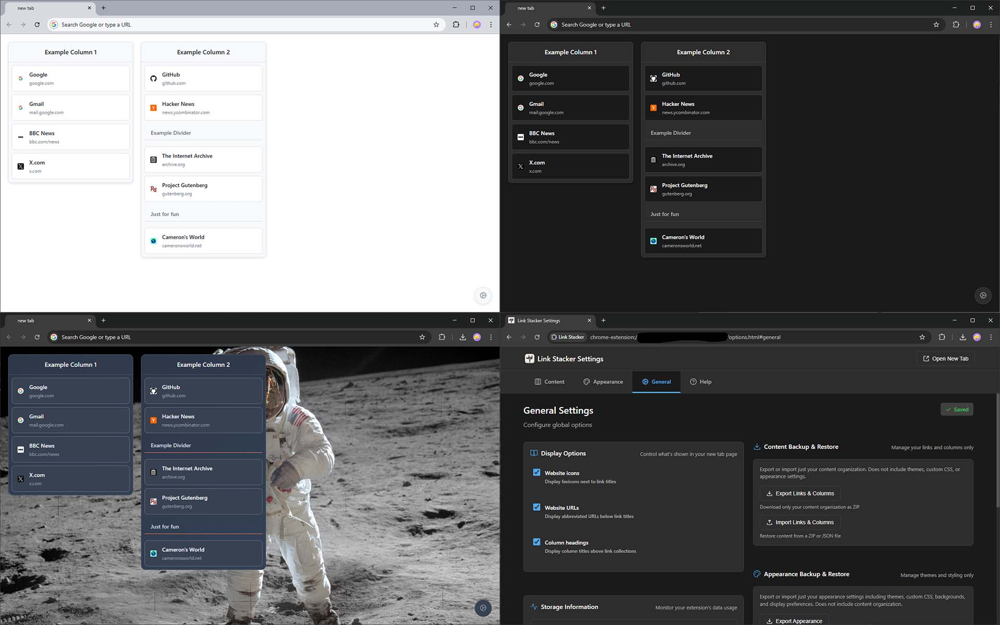

# Link Stacker

A privacy-focused, highly customizable new tab page for Chrome

[](manifest.json)
[](LICENSE)

## Overview

Link Stacker transforms your Chrome new tab page into a powerful, customizable dashboard for organizing your favorite links. With an intuitive column-based interface, it gives you complete control over how you access and organize your web destinations.

Built with vanilla JavaScript and zero external dependencies, Link Stacker prioritizes your privacy by storing all data locally on your device. No accounts, no cloud sync, no tracking – just a fast, reliable new tab experience that's entirely yours.

## ✨ Features

- 🏗️ **Organize links in customizable columns** – Create, reorder, and manage columns to match your workflow
- 🎨 **Multiple themes** – Choose from Light, Dark, Browser (system), or create your own with custom CSS
- 🔒 **Privacy-focused** – All data stored locally with no external servers or analytics
- 📦 **Import/Export** – Full backup and restore functionality with theme packages
- 🎯 **Drag & drop** – Intuitive organization with smooth drag-and-drop support
- 🖼️ **Custom styling** – Background images, colors, and full CSS customization
- ⚡ **Lightning fast** – No build process, no frameworks, just pure performance
- 🔧 **Power user features** – Built-in CSS editor with syntax highlighting and live preview

## 📸 Screenshots

[](screenshots/screenshots-github.jpeg)

Top left: the example/default set of columns, links, and dividers with the light theme.  
Top right: the default dark theme.  
Bottom left: a customized theme and background.  
Bottom right: the Appearance panel in the options page.

## 🚀 Installation

### For Development

1. Clone this repository:
   ```bash
   git clone https://github.com/a5ah1/link-stacker.git
   cd link-stacker
   ```

2. Open Chrome and navigate to `chrome://extensions/`

3. Enable "Developer mode" in the top right

4. Click "Load unpacked" and select the `link-stacker` directory

5. Open a new tab to see Link Stacker in action!

### From Chrome Web Store

*Coming soon*

## 📖 Usage

1. **Open a new tab** to see your Link Stacker dashboard
2. **Click the settings icon** (⚙️) in the top right or access via Chrome extension options
3. **Add your first column** using the "Add Column" button
4. **Add links** to your columns with titles, URLs, and optional custom icons
5. **Customize** the appearance with themes, backgrounds, and custom CSS

For detailed usage instructions, check the built-in help guide in the options page.

## 🛠️ Development

### Project Structure

```
link-stacker/
├── newtab.html       # New tab page
├── options.html      # Settings interface
├── scripts/          # Core functionality
│   ├── storage.js    # Data persistence
│   ├── theme-manager.js
│   └── utils.js
├── styles/           # CSS files
├── vendor/           # Third-party libraries
└── manifest.json     # Extension configuration
```

### Technologies

- **Vanilla JavaScript** (ES6+) – No frameworks or build tools required
- **Chrome Extension Manifest V3** – Latest extension standards
- **Chrome Storage API** – Local data persistence
- **SortableJS** – Drag and drop functionality
- **Ace Editor** – CSS editing with syntax highlighting

### Architecture

Link Stacker follows a modular architecture with clear separation between the read-only new tab interface and the full-featured options page. For detailed technical documentation, see [CLAUDE.md](CLAUDE.md).

## 🤝 Contributing

This extension is developed primarily for personal use and shared openly under the MIT license. While you're welcome to fork the project and make your own modifications, please note that active development and feature requests are limited to maintaining functionality for the original use case.

If you encounter bugs or compatibility issues, feel free to open an issue - but please understand that enhancements beyond the current scope may not be implemented.

## 🔐 Privacy

Your privacy is our priority:

- ✅ All data stored locally on your device
- ✅ No user accounts or cloud sync
- ✅ No analytics or tracking
- ✅ No external API calls (except optional favicon fetching)
- ✅ Open source for complete transparency

## 📄 License

This project is licensed under the MIT License - see the [LICENSE](LICENSE) file for details.

## 👥 Contributors

- **Claude** <noreply@anthropic.com> - AI assistant for development and documentation
- **Grok** <grok@x.ai> - AI assistant for initial development work
- **Public Domain Review** - for finding [the project's icon image](https://publicdomainreview.org/essay/stuffed-ox-dummy-tree-artificial-rock-deception-in-the-work-of-richard-and-cherry-kearton/)

## 🙏 Acknowledgments

Link Stacker includes the following open-source libraries:

- [SortableJS](https://github.com/SortableJS/Sortable/) - Drag and drop functionality
- [Ace Editor](https://github.com/ajaxorg/ace) - Code editing capabilities
- [Marked](https://github.com/markedjs/marked/) - Markdown parsing
- [JSZip](https://github.com/Stuk/jszip) - ZIP file handling
- [Animate.css](https://github.com/animate-css/animate.css) - CSS animations
